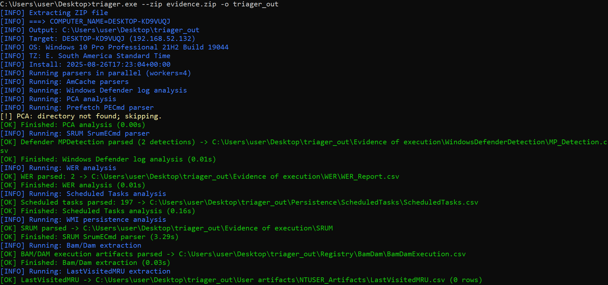
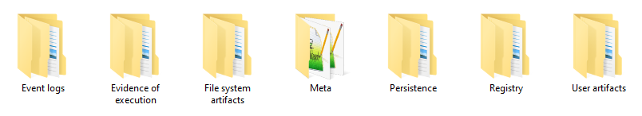
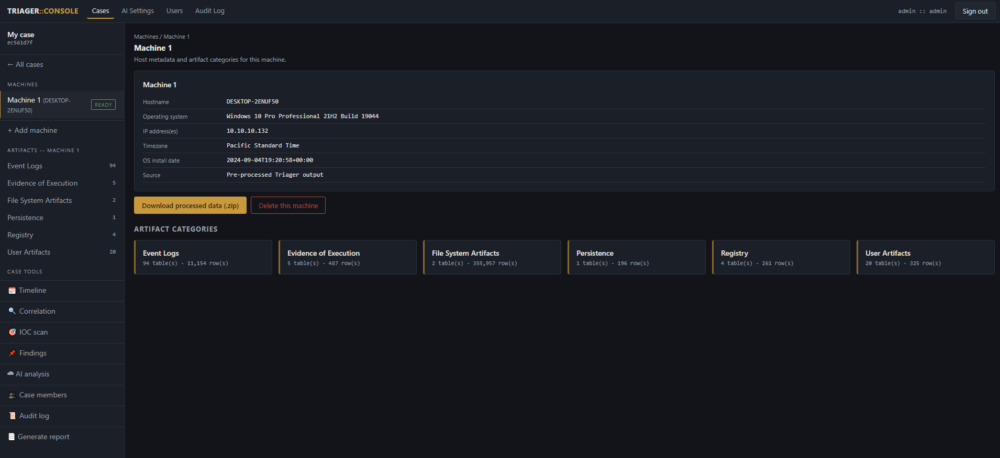
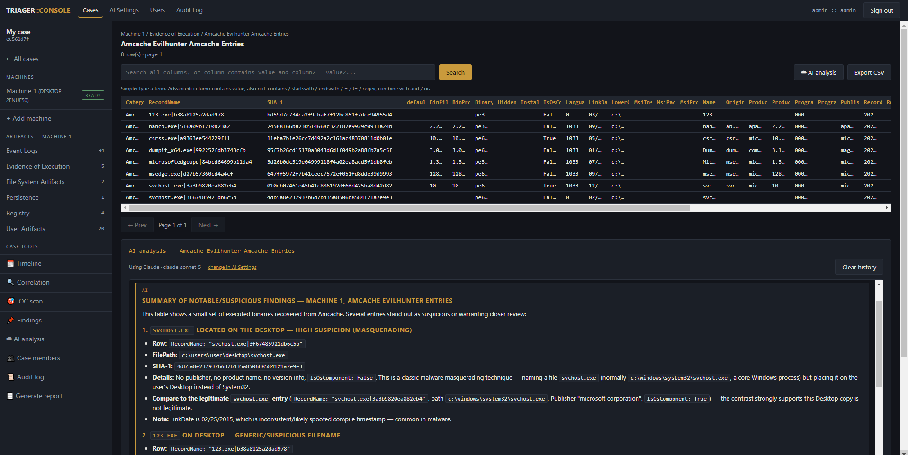
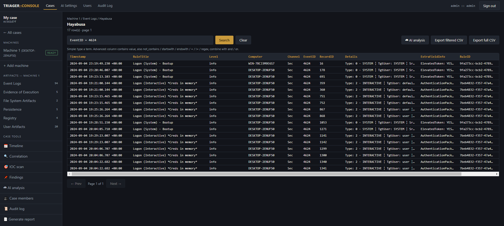
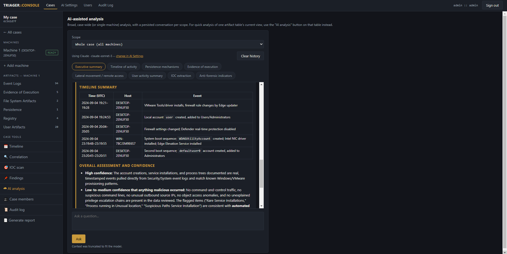

# Triager

`Triager` is a DFIR automation platform for Windows triage collections produced by tools such as `KAPE`, `Velociraptor`, and `Aralez`. It orchestrates forensic utilities, normalizes results into investigation-ready CSV files, and provides two ways to work with the evidence:

- **Triager CLI** — parses collections, searches processed results, and scans for IOCs.
- **Triager Web Console** — adds multi-case and multi-machine investigation management through a browser.

```text
cli/    Core parsing and command-line analysis
web/    Browser-based case-management and investigation workspace
```

`Triager` works with collected artifacts rather than raw disk images. Its purpose is orchestration: specialized parsers remain responsible for artifact extraction, while `Triager` provides a consistent workflow and output structure.

## Main capabilities

### Artifact processing

Triager processes and organizes evidence from:

- Windows Event Logs
- Prefetch, Amcache, Shimcache, BAM/DAM, and SRUM
- Scheduled Tasks, WMI, Windows Defender, and WER
- MFT, USN Journal, $LogFile, and Recycle Bin
- SYSTEM, SOFTWARE, NTUSER, and UsrClass registry hives
- Jump Lists, shellbags, browser and PowerShell history, Recent Files, MRUs, RDP cache, thumbnails, UserAssist, and Windows Timeline

It integrates utilities such as `PECmd`, `MFTECmd`, `EvtxECmd`, `Hayabusa`, `Chainsaw`, `APT-Hunter`, `AppCompatCacheParser`, `AmcacheParser`, `SrumECmd`, `JLECmd`, and others distributed under `cli/tools/`.




### Investigation workspace

Triager Web Console builds on the same parsing engine and adds:

- Multiple cases and machines, with one evidence archive per host
- Role-based access and per-case membership
- Velociraptor and Aralez profiles built in, plus reusable custom triage configs uploaded through the UI
- Search, filtering, CSV export, and cross-machine correlation
- Unified chronological timeline across artifacts and hosts
- IOC list scanning
- Investigator findings linked to artifact snapshots
- OpenAI and Claude-compatible AI assistance
- Word report generation
- Partial artifact access while processing is still running
- Downloadable processed evidence packages






## Quick start

### TL;DR

- Download the project and double-click `build_all.bat`
- It installs Python automatically if needed; if that fails, install
  Python 3.10+ yourself from [python.org](https://www.python.org/downloads/) and re-run it

### Triager CLI

Requirements:

- Python 3.10+
- Dependencies from `cli/requirements.txt`
- External forensic tools under `cli/tools/`

```bash
pip install -r cli/requirements.txt

# Process a triage directory
python3 triager.py --root triage_collection -o output_directory

# Process a ZIP using the Aralez profile and compress the result
python3 triager.py --zip triage_collection.zip \
  --profile aralez -o output_directory --compress

# Search previously processed output
python3 triager.py -d output_directory --search "PsExec"

# Scan processed output for indicators
python3 triager.py -d output_directory --find-iocs cli/iocs.txt
```

Velociraptor is the default collection profile. Aralez is also built in:

```bash
--profile velociraptor
--profile aralez
```

For another collection layout, provide a YAML configuration file. A custom configuration takes precedence over the selected profile:

```bash
python3 triager.py --zip collection.zip \
  -c config.yml -o output_directory
```

A configuration maps artifact names to paths relative to the collection root, for example:

```yaml
System32: "uploads\\auto\\C%3A\\Windows\\System32"
EventLogs: "uploads\\auto\\C%3A\\Windows\\System32\\winevt\\Logs"
Prefetch: "uploads\\auto\\C%3A\\Windows\\Prefetch"
AmCache: "uploads\\auto\\C%3A\\Windows\\AppCompat\\Programs\\Amcache.hve"
MFT: "uploads\\ntfs\\%5C%5C.%5CC%3A\\$MFT"
Users: "uploads\\auto\\C%3A\\Users"
RegistryHives:
  SYSTEM: "uploads\\auto\\C%3A\\Windows\\System32\\config\\SYSTEM"
  SOFTWARE: "uploads\\auto\\C%3A\\Windows\\System32\\config\\SOFTWARE"
UserHives:
  NTUSERGlob: "Users\\*\\NTUSER.DAT"
  USRCLASSGlob: "Users\\*\\AppData\\Local\\Microsoft\\Windows\\UsrClass.dat"
```

### Triager Web Console

From the repository root:

```bash
cd web
pip install -r backend/requirements.txt
python3 desktop/launcher.py
```

The launcher starts the server and opens:

```text
http://127.0.0.1:8000
```

The launcher can run from source on Linux or Windows and can be packaged as a desktop distribution. Raw evidence ingestion requires the Windows `Triager.exe`; already processed `Triager` output can be imported without rerunning the parser.

For direct server execution:

```bash
cd web/backend
python3 -m venv .venv
source .venv/bin/activate
pip install -r requirements.txt

export TRIAGER_WEB_ADMIN_USER=admin
export TRIAGER_WEB_ADMIN_PASSWORD=change-me

uvicorn app.main:app --host 0.0.0.0 --port 8000
```

## How the web pipeline works

Each case may contain multiple machines. Each machine represents one host and supports two ingestion paths:

1. **Raw evidence** — extracts a `KAPE`, `Velociraptor`, or `Aralez` archive, runs `Triager`, and imports the resulting CSV files.
2. **Processed output** — imports an archive containing an existing `Triager` output directory and skips parsing.

```text
Evidence ZIP
    │
    ▼
Extraction
    │
    ▼
Triager CLI execution ── skipped for processed output
    │
    ▼
Normalized CSV files
    │
    ▼
Per-case SQLite database + FTS5 indexes
    │
    ▼
Browser investigation workspace
```

Every CSV becomes a machine-namespaced table in a shared per-case SQLite database. FTS5 companion tables support fast correlation across large datasets, while timestamp columns are normalized during import to build the unified timeline efficiently.

Host information such as hostname, operating system, IP addresses, timezone, and installation date is read from `Meta/host_profile.json` after ingestion.

## Output structure

```text
Event logs/             APT-Hunter, Chainsaw, EvtxECmd, Hayabusa
Evidence of execution/  Amcache, Prefetch, SRUM, WER, Defender detections
File system artifacts/  $LogFile, MFT, Recycle Bin, USN Journal
Meta/                   Host profile, software, autoruns, effective config
Persistence/            Scheduled Tasks, WMI
Registry/               BAM/DAM, Shimcache, USB
User artifacts/         Browser history, Jump Lists, shellbags, UserAssist,
                        PSReadLine, RDP cache, thumbnails, timelines, and more
```

## Security notes

- Treat `storage/` as sensitive forensic evidence and restrict filesystem access.
- AI analysis sends selected evidence to the endpoint configured by the investigator. Use a trusted local endpoint or obtain authorization before sending case data to a hosted provider.

## Standalone builds

Run `build_all.bat` from the repository root to build both in one go,
it installs Python automatically if it is not already on `PATH` (by
downloading the official installer from python.org), builds the CLI and
the web desktop app, copies both into `compiled_binaries/` at the
repository root, and starts Triager Web Console from there.

```text
compiled_binaries/
  cli/Triager.exe
  web/TriagerWeb.exe
```

- `cli/build.bat` creates a single-file Windows CLI executable, bundles
  `cli/tools/` when available, and copies the result into
  `web/backend/tools/`.
- `web/desktop/build_web.bat` packages the web launcher into a standalone
  distributable and includes `Triager.exe` from `web/backend/tools/` if
  present. Both scripts set up their own virtual environment and install
  their own dependencies, so they also work standalone.

## License

Triager is released under the MIT License. See [LICENSE](LICENSE).
